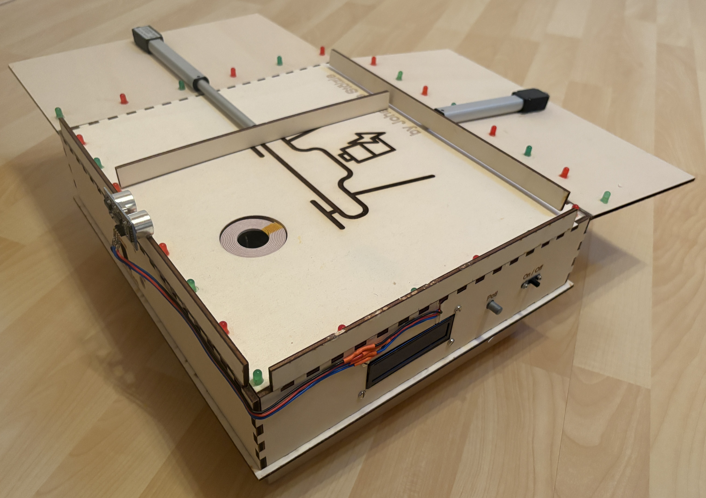
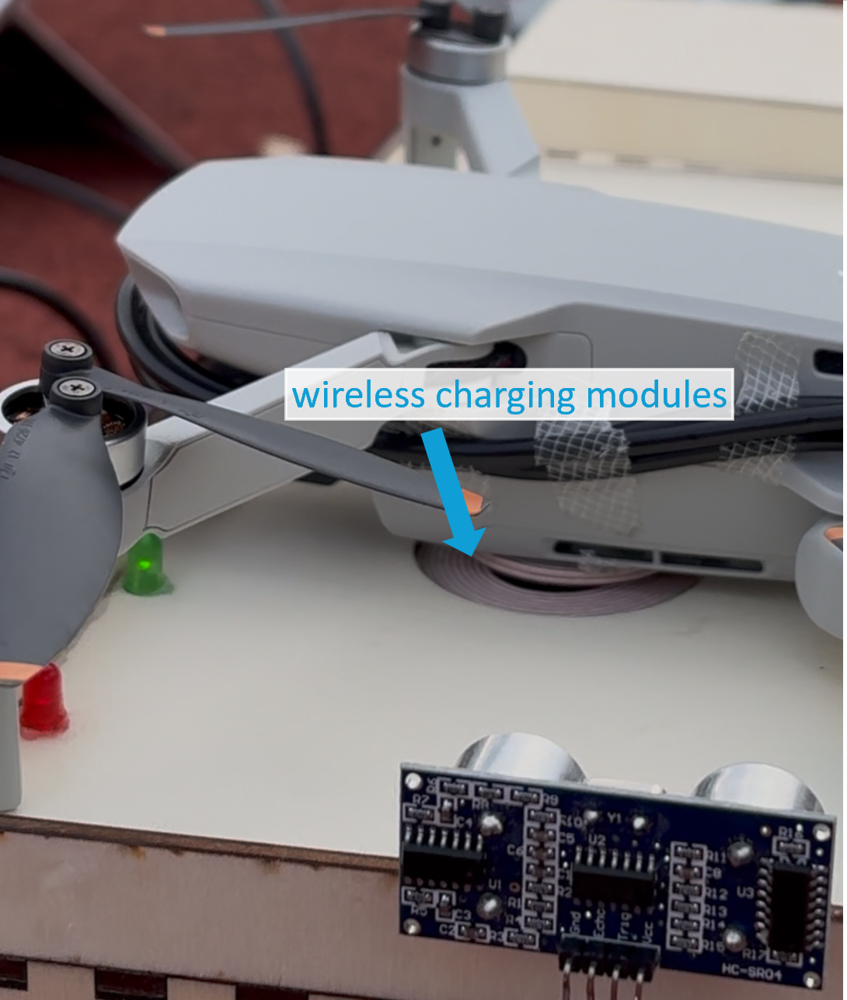

# 📘 Autonomous Drone Charging Station
## 🔗 Online Access

- This project was featured in the following thesis: <https://drive.google.com/drive/folders/1ag495ByeFjiVlfqUUsdaL6ZCu044Agzx>
- GitHub Repository of the thesis: <https://github.com/jostoelz/Autonomous-Drone-System-for-Wolf-Detection-Deterrence-and-Sheep-Protection>

## 🔍 Abstract
This system provides an automated charging solution for drones, enabling recharging and positioning without manual intervention. It features a landing platform with a dual-axis mechanical positioning mechanism and integrated ultrasonic sensors to trigger linear actuators upon touchdown. These actuators ensure precise corner alignment for optimal wireless coupling between the station's inductive transmitter and the aircraft's receiver.
The station functions as a standalone, plug-and-play system that converts AC to DC current for the drone's battery while offering a weather-resistant enclosure for protection against precipitation. Operational flexibility is enhanced by an adjustable LED lighting system for nighttime landings and an LCD providing real-time status updates. While the current design is specifically dimensioned for the DJI Mini, other aircraft like the Duckiedrone require modifications because their LiPO batteries are incompatible with the existing wireless charging interface.

## 📖 Citation

If you find this project useful for your research, please consider citing it:

```bibtex
@software{Stoelzle2024,
  author       = {St{\"o}lzle, Johannes},
  title        = {Autonomous Drone Charging Station },
  year         = 2025,
  url          = {[https://github.com/jostoelz/Autonomous-Drone-Charging-Station)}
}
```

## 🧭 Visual Overview

<p align="center">
  
  <br/>
  <em>External view of the drone charging station.</em>
</p>

<p align="center">
  
  <br/>
  <em>Wireless charging interface between the drone and the station.</em>
</p>

## 📜 License

[](https://opensource.org/licenses/Apache-2.0)

This project is licensed under the Apache License 2.0 - see the [LICENSE](LICENSE) file for details.

---
✨ Enjoy exploring the thesis materials. 
