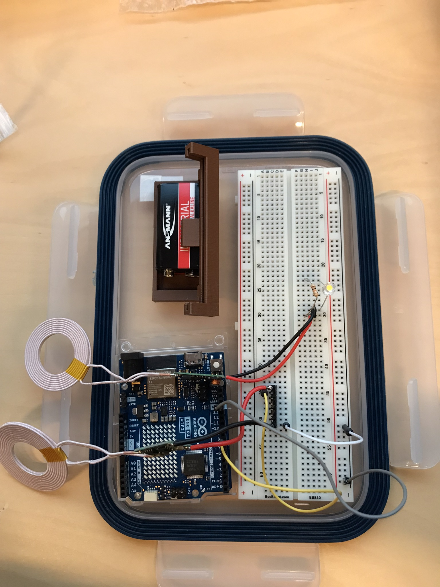
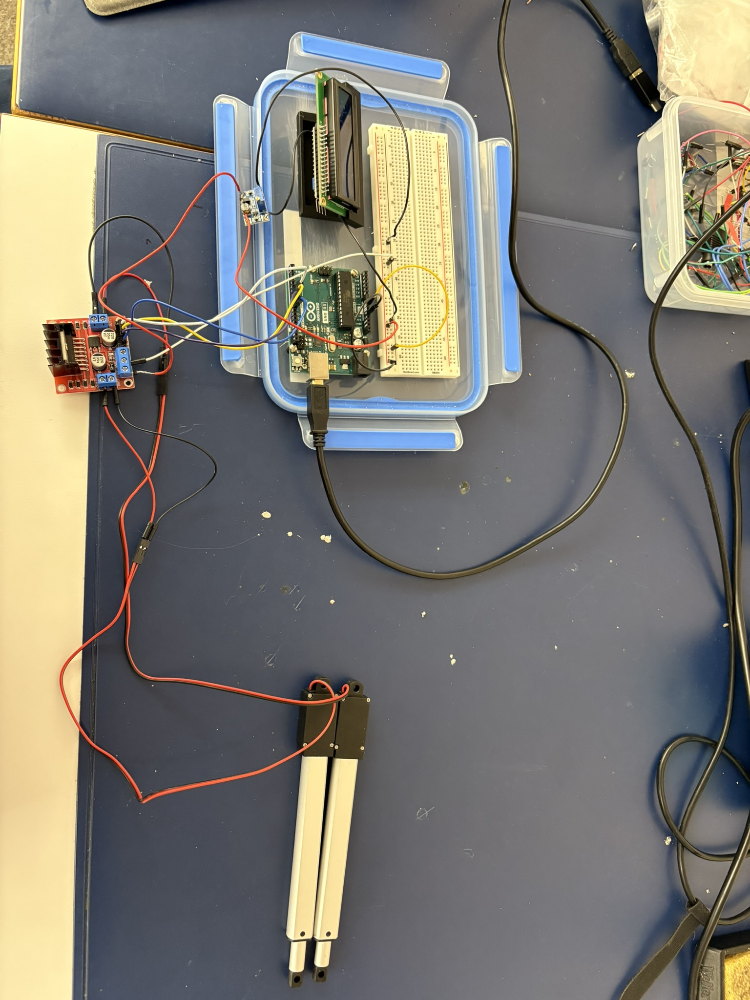
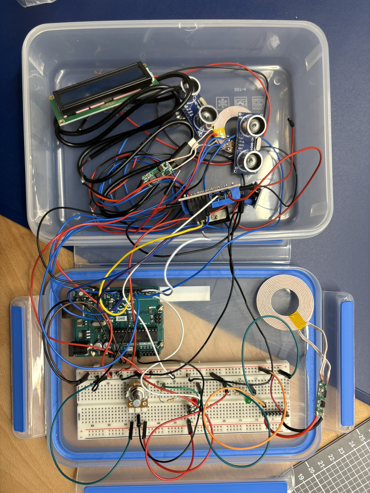
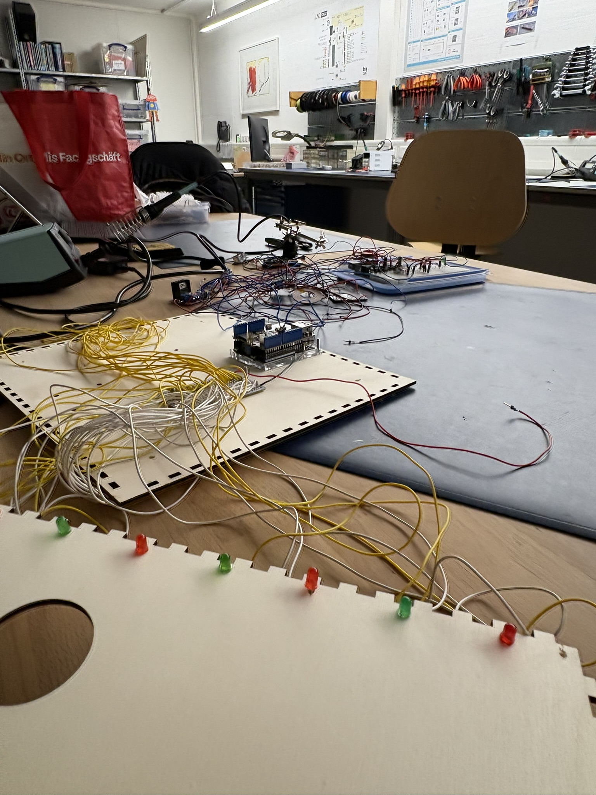
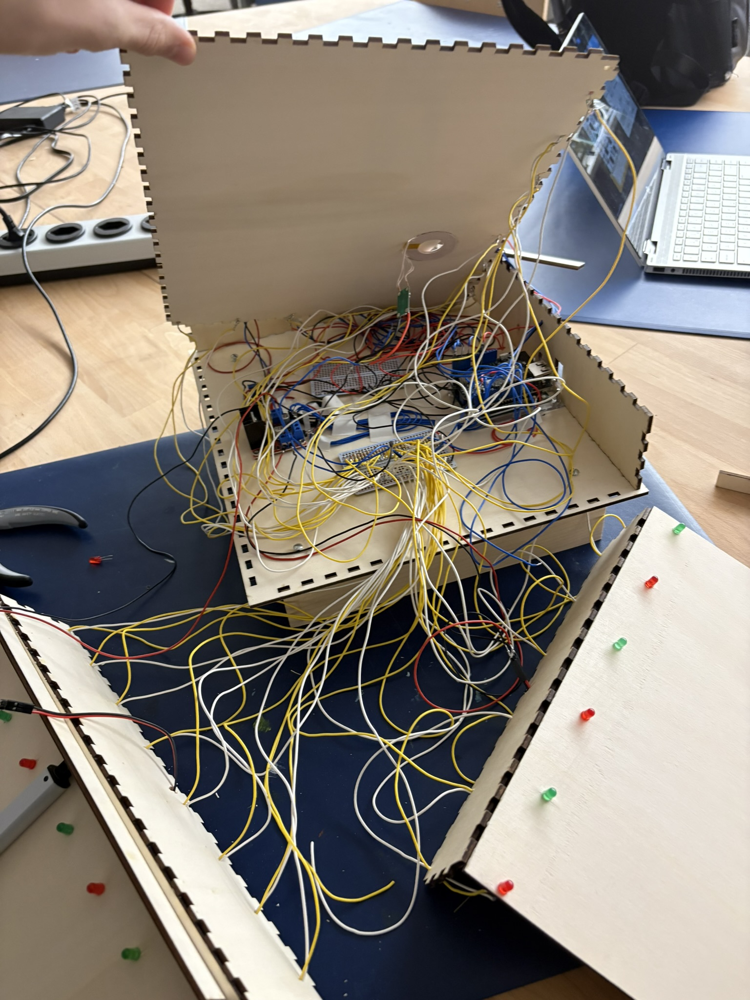

# Abstract
In this project, I am building an automatic charging device for drones. Once the pilot has landed the drone on a platform, a mechanism is activated that moves the drone into the correct position and starts the charging process. After the charging process is complete, the drone is ready for takeoff again.

# Project in Detail
The pilot lands on a landing platform. The landing platform has walls on two sides where two ultrasonic sensors are mounted. On the other two sides, a linear actuator with a slider is attached to each. As soon as the ultrasonic sensors detect a drone on the landing platform, the linear actuators move the drone into the corner until it is in the correct position. A wireless charging transmitter is mounted below the landing platform, while the corresponding wireless charging receiver is located underneath the drone. As soon as the ultrasonic sensors detect that the drone is in the corner, current flows from a power supply to the wireless charging transmitter. The receiver on the drone converts the alternating voltage into direct current, which then flows into the drone's battery, which is connected to the wireless charging receiver via a cable. Once the charging process is complete, the drone can take off again.

## Which features were implemented?
Besides the fact that the drone is able to land on a platform, the linear actuators can move the drone into the correct position, it can be charged independently via wireless charging and can then take off again, the station is equipped with LEDs that illuminate the landing site in the dark and can be switched on/off with a potentiometer. This allows the pilot to land the drone safely even at night or in poor visibility conditions. Furthermore, the charging station is characterized by the fact that it is permanently closed to protect itself against precipitation. The robust construction also makes handling the station flexible, so that the station can be set up variably. Furthermore, a display was installed that shows the current status: ready to land, maneuvering, or charging. A button offers flexible use of the station by allowing it to be switched on/off. In addition, the station does not need to be connected to a computer to function, but can simply be connected to a socket with a power supply unit. This allows for further flexibility.

## Description of the Hardware
The electronic components used are listed in the following table.

<table>
  <thead>
    <tr>
      <th>Components</th>
      <th>Price per piece</th>
      <th>Link</th>
    </tr>
  </thead>
  <tbody>
    <tr>
      <td>Wireless charging transmitter & receiver</td>
      <td>7.71 Fr.</td>
      <td>https://www.mouser.ch/ProductDetail/Seeed-Studio/106990017?qs=SElPoaY2y5KdLskE1shzqQ%3D%3D&mgh=1&utm_id=20002739518&gad_source=1&gclid=CjwKCAiA3ZC6BhBaEiwAeqfvyuNlfda5-xuXoLrLc3qdhUh8dxR87X4ZW45SWwa3tzxUaDRKo-8zQBoC-xEQAvD_BwE</td>
    </tr>
    <tr>
      <td>Open end to USB C</td>
      <td>5.45 Fr.</td>
      <td>https://www.conrad.ch/de/p/usb-c-3-1-stecker-mit-offenem-kabelende-usb-c-3-1-tc-2509033-tru-components-inhalt-1-st-1587137.html</td>
    </tr>
    <tr>
      <td>Power supply</td>
      <td>5.33 Fr.</td>
      <td>https://www.reichelt.com/ch/de/shop/produkt/steckernetzteil_10_w_5_v_2_a-370227?PROVID=2808&gad_source=1&gclid=Cj0KCQiAi_G5BhDXARIsAN5SX7rT-tWpARV_9-TJFdsRmyKfdBHIgLwCn7fREIx21GYVdz2y2PMDzvgaAjFpEALw_wcB&q=%2Fch%2Fde%2Fshop%2Fsteckernetzteil-10-w-5-v-2-a-ys12v-0502000e-p370227.html </td>
    <tr>
      <td>Transformer</td>
      <td>3.90 Fr.</td>
      <td>https://www.bastelgarage.ch/dc-dc-1-5a-step-up-boost-converter </td>
    </tr>
    <tr>
      <td>Mosfet</td>
      <td>2.25 Fr.</td>
      <td>https://www.adafruit.com/product/355 </td>
    </tr>
    <tr>
      <td>Linear actuator</td>
      <td>35.90 Fr.</td>
      <td>https://www.bastelgarage.ch/6v-electric-cylinder-100mm-128n?gad_source=1&gclid=Cj0KCQiAi_G5BhDXARIsAN5SX7pOlEy0XSUf0RxYFtqWwyanmA4Y5NWjRPP5CRwlg6IoworPIEc1klAaAvznEALw_wcB</td>
    </tr>
    <tr>
    <td>Motor driver</td>
    <td>6.60 Fr.</td>
    <td>https://www.conrad.ch/de/p/joy-it-sbc-motodriver2-entwickler-platine-1-st-1573541.html?utm_source=google-shopping-de&utm_medium=search&utm_campaign=shopping-online-de&utm_content=shopping-ad_cpc&WT.srch=1&ef_id=Cj0KCQiAi_G5BhDXARIsAN5SX7o6_0Nbb4KqGNjm55Ye8g1xzGAJNyGisIYAgcIQBwoagaDJP2YjFNAaAjlnEALw_wcB%3AG%3As&utm_source=google&utm_medium=cpc&utm_campaign=ade_3_shopping_GERMAN&utm_id=319998844&gad_source=1&gclid=Cj0KCQiAi_G5BhDXARIsAN5SX7o6_0Nbb4KqGNjm55Ye8g1xzGAJNyGisIYAgcIQBwoagaDJP2YjFNAaAjlnEALw_wcB </td>
    </tr>
    <tr>
    <td>Ultrasonic sensor</td>
    <td>3.28 Fr.</td>
    <td>https://www.reichelt.com/ch/de/shop/produkt/entwicklerboards_-_ultraschall_abstandssensor_hc-sr04-161487?PROVID=2788&gad_source=1&gclid=CjwKCAiAl4a6BhBqEiwAqvrquhSdVMxJ-SXono8RQaygsfe0myq6rt9zlikawhww3HqIJLXRNSHbShoCsIEQAvD_BwE&q=%2Fch%2Fde%2Fshop%2Fentwicklerboards-ultraschall-abstandssensor-hc-sr04-debo-sen-ultra-p161487.html </td>
    </tr>
  </tbody>
</table>

An important note is that I have installed two ultrasonic sensors and two linear actuators. In addition, there are inexpensive standard components such as a potentiometer, a display, a slide switch, LEDs, and resistors.  
 
The following illustration shows the hardware on the drone. The wireless charging receiver was mounted on the bottom of the drone with adhesive tape. A cable with an open end to USB C was soldered to the receiver. The USB C end was finally plugged into the drone.

The hardware at the landing platform is illustrated in the next image. It must be noted that 27 LEDs were installed instead of just one, as shown in the picture. 

In the following section, the most important installed components are shown with pictures.  
  The Arduino is the brain of the device. It coordinates and collects all commands. An Ethernet shield is also mounted on it, which I could no longer get to function as desired.  

The current status of the device is shown on the display. This can be "Ready to land", "Maneuvering", or "Charging". 

On the circuit board for the LEDs, resistors are connected to the positive cables (yellow). These end at the LEDs. The negative pole of the LEDs leads back to the GND of the board.

Almost all hardware is unified on the soldering board. This is where the positive and negative poles are collected:

The motor driver is used to coordinate the linear motors:

The potentiometer can be used to set a variable resistance. This is used to turn the LEDs on/off by rotating the potentiometer.

A switch is used to send either "HIGH" or "LOW" to the digital pin. This allows for deciding whether the device should be on or off.

A step-up voltage regulator is used because the linear actuators require 6V, but the Arduino only supplies 5V.

The ultrasonic sensors measure the distance between two objects. This happens by measuring the time it takes for the echo to return. The ultrasonic sensors were glued to small walls, which later help ensure that the drone does not move further than the desired corner.

The positive pole of the wireless charging transmitter is connected to a pin to be able to decide when to charge and when not to.

The linear actuators can be controlled forward and backward as desired using the motor driver. A wooden slider was glued to each of the linear actuators so that the drone can be maneuvered across the entire width of the station.

## Description of the Software
The software is structured such that (as long as the device is switched on) the ultrasonic sensors constantly measure the distance. If they detect an object closer than usual, the motors are switched on. Then, there are two cycles during which both linear actuators extend fully one after the other. Two cycles are carried out to ensure that the drone is really in exactly the right position. When the maneuver is complete, the pin for wireless charging is supplied with power. When the drone has flown away again (checked by the measured distance of the ultrasonic sensors), the power supply for wireless charging is terminated.

## Usage
The functionality of the device can only be checked to a limited extent without a drone. However, a 7V-12V power supply can be plugged into the power jack. Then you should at least be able to switch the LEDs on/off, operate the on/off button, and read the text "Ready to land" on the display. Alternatively, you can run the code below again via the Arduino IDE.

## Demonstration
I have recorded a <a href="https://kantonsschuleromanshorn-my.sharepoint.com/:v:/g/personal/jostoelz_ksr_ch/EYghmAxh7fZNp1EXa3LVJkMBQi_qL3hC4DV3Lf5EdQMKvw?e=Lkv3ng ">video</a> demonstrating the charging station in action. To prove that the drone is actually being charged, I am happy to show this directly on the drone after the project is submitted. Unfortunately, it is not possible to capture this in a video. Likewise, the on/off switch, the display, the potentiometer, and the LEDs are not demonstrated in more detail in the video.

# Development
First, I thought about different solution approaches for a charging station for drones (see sketch below). Once I decided on one, I imagined the station as follows: 

Then I took the measurements for the housing. I had to carry out many measurements and simulate the drone's landings several times to ensure that the dimensions fit together. The following sketch shows the results:

Before I put all the components together, I had to test the individual parts first. The next pictures show sections of this:   
In the following figure, I checked the functionality of the wireless charging using an LED:

I also tested the linear actuators:

The ultrasonic sensors, the potentiometer, and the LEDs also had to be tried out. The following picture shows this (where wireless charging was also included).

Since all components worked on the breadboard, I was able to transfer them to the station and integrate them finally.

When this process was over, you could slowly see what the inside of the station looked like. 

# Discussion & Reflection
## What went well, what went less well?
When the project started, it was first about finding ideas and then thinking about how to implement them. This was a tedious matter for me, as there are no online tutorials on how to build an independent DIY charging station for drones. Specifically, it was difficult to find out how to bring the drone into the right position and how to charge it (by cable or with wireless charging). I sketched some of my thoughts on this: 

Another difficulty was finding the right parts, because the drone also had to be taken into account in terms of current and voltage. The research for this took a long time. In addition, the materials arrived several weeks late, which meant that work with the parts could only begin quite late.
In contrast, the assembly of the various electronic components was uncomplicated. On the other hand, the construction of the station required many measurements and took a lot of time. It had to be carefully considered how and, above all, in what order to manufacture and fasten everything. Above all, it was necessary to work precisely so that the wireless charging components are exactly aligned on top of each other, as illustrated in the following image.

## What would I do differently?
Next time, I would stick more to my schedule and achieve the most important goals first before devoting myself to the expansions. Unfortunately, I spent several weeks on the optional feature of accessing external weather forecasts via an API. I wanted to give the pilot a recommendation (depending on wind & precipitation) about flying. However, this feature always failed at a certain point. I didn't want to give up and so I kept pushing back the actually important tasks, such as manufacturing the box. Finally, I got into a rush and was therefore no longer able to implement desired changes due to time constraints.

## Extensions
* A significant improvement of the charging station would be that charging the drone no longer (as before) only works if the drone lands in a specific orientation (with the camera forward and sideways to the short side of the station), but can land variably. This would require two more linear actuators, which was not possible within the budget of this project.
* Another expansion would be to equip the box with weather sensors and give the pilot recommendations on whether or not to fly depending on weather conditions.
* Likewise, the box could be expanded with solar panels so that it is self-sufficient and recharges itself in good weather.
* One could also make the station out of metal and insulate the electronic connections so that they are better protected from moisture.
* A further expansion could be the installation of a GPS, so that safe landing without visual contact is possible, the fastest route between the drone and the charging station can be displayed, or tracking can take place if the station was stolen.

# Code
<pre>#include <Wire.h>
#include <LiquidCrystal_I2C.h>
#include "OneButton.h"

#define ECHO_INPUT_PIN_2 5  // Echo input pin ultrasonic sensor 1
#define TRIGGER_OUTPUT_PIN_2 6  // Trigger output pin ultrasonic sensor 1
#define ECHO_INPUT_PIN_1 11 // Echo input pin ultrasonic sensor 2
#define TRIGGER_OUTPUT_PIN_1 10 // Trigger output pin ultrasonic sensor 2

// Required variables
int DRONE_DISTANCE = 24; 
int CONVERSION_FACTOR = 58.2; // Speed of sound divided by 2
long TIME_TO_DRONE = 45000; // Time for linear actuator to travel to drone
int LinearActuator_ON = 180;
int LinearActuator_OFF = 180;
long distance1; // Ultrasonic sensor 1
long distance2; // Ultrasonic sensor 2
long duration1; // Ultrasonic sensor 1
long duration2; // Ultrasonic sensor 2
int counter = 0;

// Motor 1
const int MOTOR_PIN_1 = 9; // Forward
const int MOTOR_PIN_2 = 8; // Backward

// Motor 2
const int MOTOR_PIN_3 = 7; // Forward
const int MOTOR_PIN_4 = 4; // Backward

// LED & Control
const int POT_PIN = A0;  // Pin for the potentiometer
const int LED_PIN = 2;   // PWM pin for the LED
const int POWER_PIN = 13; // Pin for wireless charging
const int SWITCH_PIN = 12;  // Pin for the switch

LiquidCrystal_I2C lcd(0x27, 20, 4); // LCD with 20 characters, 4 lines

void setup() {
    // Use switch pin as internal pull-up resistor
    pinMode(SWITCH_PIN, INPUT_PULLUP); 

    // Set LED pin as output
    pinMode(LED_PIN, OUTPUT); 

    // Set ultrasonic sensor pins as inputs & outputs
    pinMode(TRIGGER_OUTPUT_PIN_1, OUTPUT);
    pinMode(ECHO_INPUT_PIN_1, INPUT);
    pinMode(TRIGGER_OUTPUT_PIN_2, OUTPUT);
    pinMode(ECHO_INPUT_PIN_2, INPUT);

    // Set motor pins as outputs
    pinMode(MOTOR_PIN_1, OUTPUT);
    pinMode(MOTOR_PIN_2, OUTPUT);
    pinMode(MOTOR_PIN_3, OUTPUT);
    pinMode(MOTOR_PIN_4, OUTPUT);
    pinMode(POWER_PIN, OUTPUT);

    // Initialize LCD
    lcd.init();
    lcd.backlight();
}

void loop() {
    int switchState = digitalRead(SWITCH_PIN); 
    
    if (switchState == HIGH) { // Switch turned on
        lcd.setCursor(0, 1);

        if (counter == 0) {
            lcd.clear();
            lcd.print("Ready to land");
        } else if (counter > 0 && counter < 3) {
            lcd.clear();
            lcd.print("Maneuvering");
        } else if (counter == 3) {
            lcd.clear();
            lcd.print("Charging");
        }

        // Distance measurement for sensor 1
        digitalWrite(TRIGGER_OUTPUT_PIN_1, HIGH);
        delayMicroseconds(10);
        digitalWrite(TRIGGER_OUTPUT_PIN_1, LOW);
        duration1 = pulseIn(ECHO_INPUT_PIN_1, HIGH);
        distance1 = duration1 / CONVERSION_FACTOR; 

        // Pause between ultrasonic measurements
        delay(500); 

        // Distance measurement for sensor 2
        digitalWrite(TRIGGER_OUTPUT_PIN_2, HIGH);
        delayMicroseconds(10);
        digitalWrite(TRIGGER_OUTPUT_PIN_2, LOW);
        duration2 = pulseIn(ECHO_INPUT_PIN_2, HIGH);
        distance2 = duration2 / CONVERSION_FACTOR;

        // Pause between ultrasonic measurements
        delay(500);

        if ((distance1 >= 1 && distance1 <= DRONE_DISTANCE) || (distance2 >= 1 && distance2 <= DRONE_DISTANCE)) {
            if (counter < 2) {
                analogWrite(MOTOR_PIN_1, LinearActuator_ON);
                delay(TIME_TO_DRONE);
                analogWrite(MOTOR_PIN_1, LinearActuator_OFF);
                delay(900); // Pause between both motor directions
                analogWrite(MOTOR_PIN_2, LinearActuator_ON);
                delay(TIME_TO_DRONE);
                analogWrite(MOTOR_PIN_2, LinearActuator_OFF);
                analogWrite(MOTOR_PIN_3, LinearActuator_ON);
                delay(TIME_TO_DRONE);
                analogWrite(MOTOR_PIN_3, LinearActuator_OFF);
                delay(900); // Pause between both motor directions
                analogWrite(MOTOR_PIN_4, LinearActuator_ON);
                delay(TIME_TO_DRONE);
                analogWrite(MOTOR_PIN_4, LinearActuator_OFF);
                counter++;
            }
        }

        // Switch on wireless charging
        if (counter == 2) {
            digitalWrite(POWER_PIN, HIGH);
            counter++;
        }

        // Switch off wireless charging if drone has flown away
        if (distance1 >= DRONE_DISTANCE && distance2 >= DRONE_DISTANCE) {
            digitalWrite(POWER_PIN, LOW);
            counter = 0;
        }

        // Adjust LED brightness
        int potValue = analogRead(POT_PIN);
        int pwmValue = map(potValue, 0, 1023, 0, 255);
        analogWrite(LED_PIN, pwmValue);
        delay(10);
    } else { // Switch turned off
        analogWrite(LED_PIN, 0); // Turn off LEDs
        counter = 0;
        lcd.clear();
    }
}</pre>
