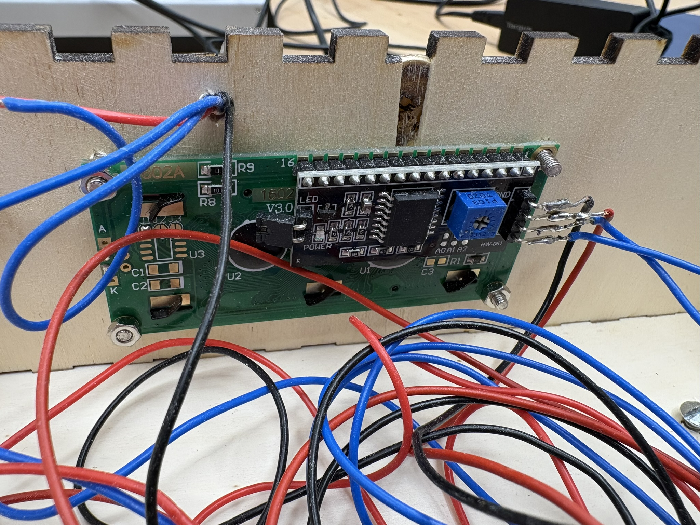
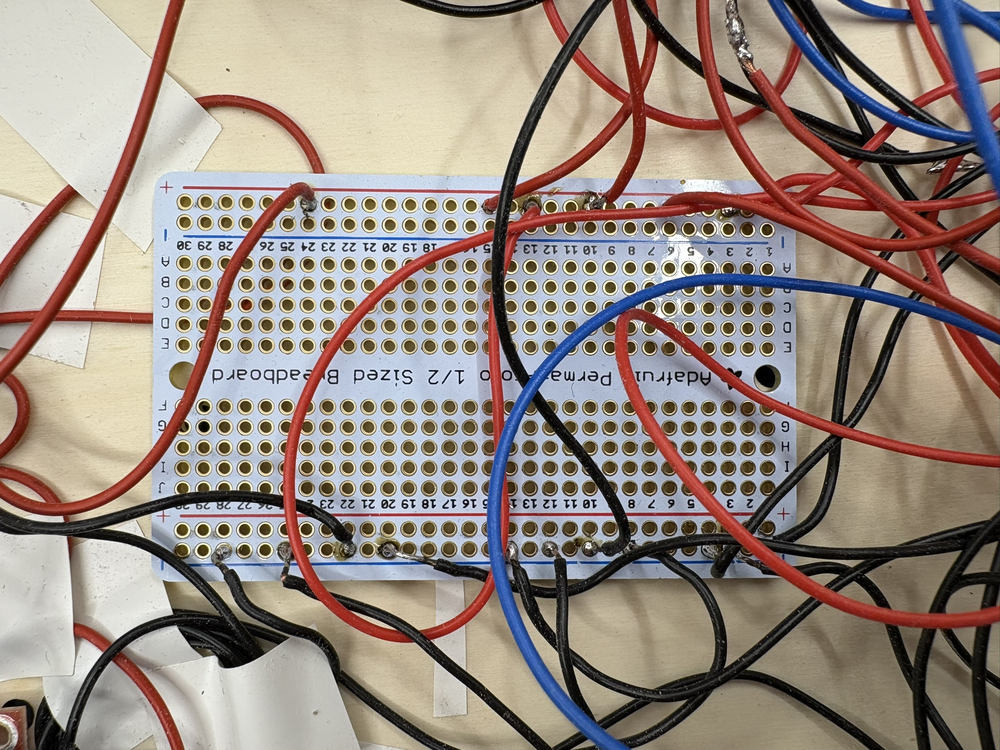
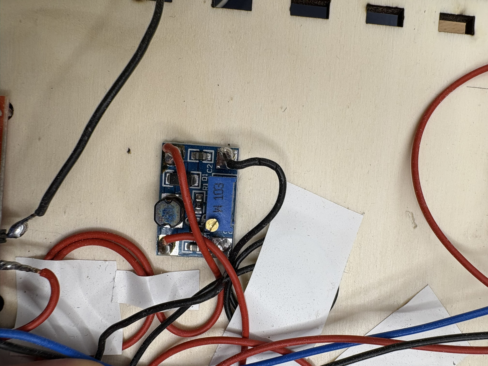
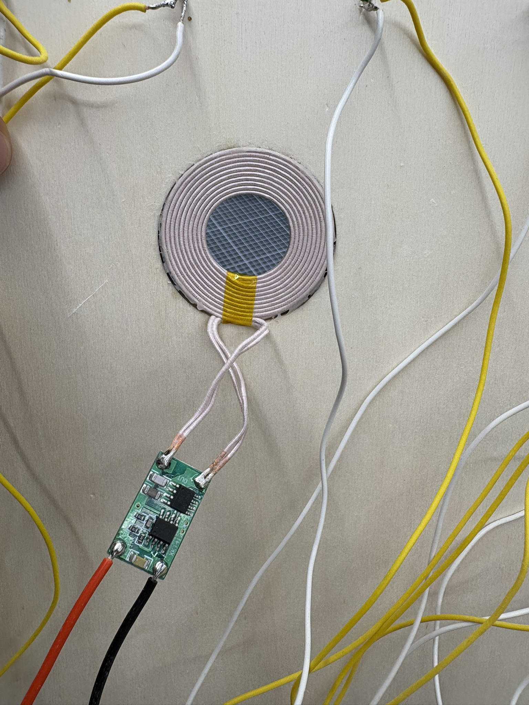
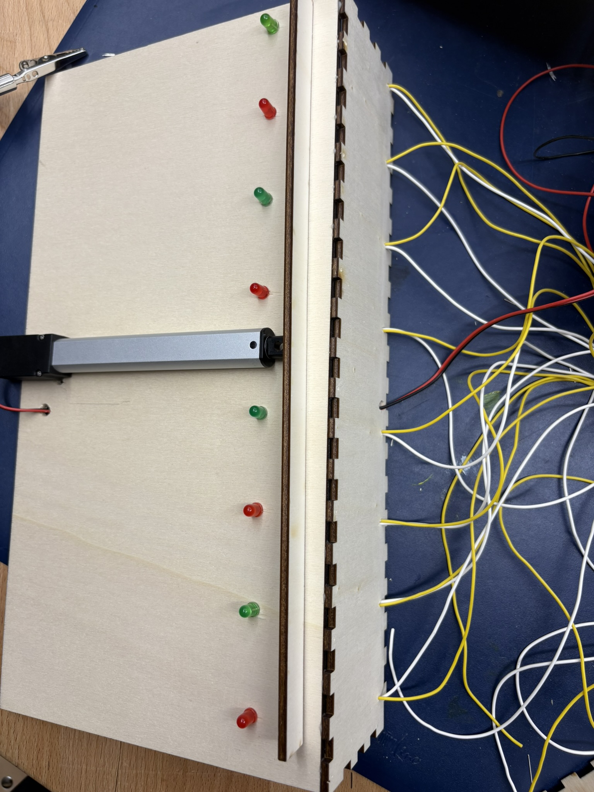
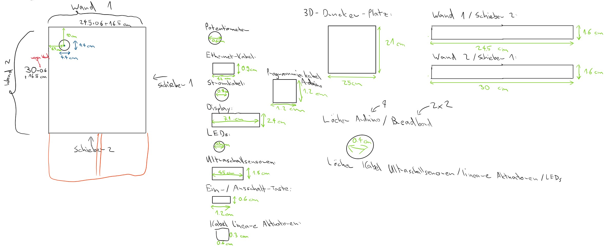
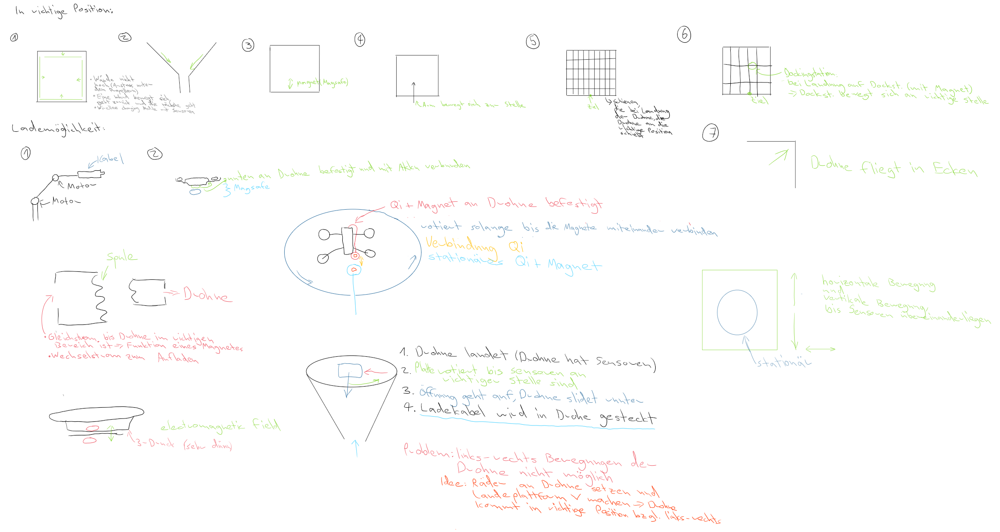

# Abstract
In diesem Projekt baue ich eine automatische Ladevorrichtung für Drohnen. Sobald die Drohne vom Piloten auf einer Plattform gelandet wurde, wird ein Mechanismus aktiviert, der die Drohne in die richtige Position bringt und den Ladevorgang startet. Nach Abschluss des Ladevorgangs ist die Drohne wieder abflugbereit.
# Projekt im Detail
Der Pilot landet auf einer Landeplattform. Die Landeplattform verfügt an zwei Seiten über Wände, an denen zwei Ultraschallsensoren angebracht sind. An den anderen beiden Seiten ist jeweils ein Linearantrieb mit einem Schieber angebracht. Sobald die Ultraschallsensoren eine Drohne auf der Landeplattform erfassen, bewegen die Linearantriebe die Drohne so weit in die Ecke, bis sie sich in der richtigen Position befindet. Unterhalb der Landeplattform ist ein wireless charging Sender montiert, während sich unterhalb der Drohne der entsprechende wireless charging Empfänger befindet. Sobald die Ultraschallsesonren erkennen, dass sich die Drohne in der Ecke befindet, fließt Strom von einem Netzteil zum wireless charging Sender. Der Empfänger an der Drohne wandelt die Wechselspannung in Gleichstrom um, der dann in den Akku der Drohne fließt, der über ein Kabel mit dem wireless charging Empfänger verbunden ist. Sobald der Ladevorgang abgeschlossen ist, kann die Drohne wieder abheben.
## Welche Features wurden umgesetzt?
Nebendessen, dass die Drohne in der Lage ist, auf einer Plattform zu landen, die Linearantriebe die Drohne in die richtige Position bewewegen können, sie über wireless charging selbständig aufgeladen und anschliessend wieder abheben kann, ist die Station mit LEDs ausgestattet, die den Landeplatz bei Dunkelheit beleuchten und mit einem Poti an- / ausgeschaltet werden können. So kann der Pilot die Drohne auch nachts oder bei schlechten Sichtverhältnissen sicher landen. Fernerhin zeichnet sich die Ladestation damit aus, dass sie dauerhaft geschlossen ist, um sich gegen Niederschlag zu schützen. Aber auch der robuste Aufbau macht die Handhabung mit der Station flexibel, so dass die Station variabel aufstellbar ist. Des Weiteren wurde ein Display verbaut, das den aktuellen Status anzeigt: landebereit, am Manövrieren oder am Laden. Ein Knopf bietet eine flexible Benutzung der Station, indem sie an- / ausgeschaltet werden kann. Ausserdem muss die Station nicht mit einem Computer verbunden werden, um zu funktionieren, sondern kann einfach mit einem Netzteil an eine Steckdose angeschlossen werden. Dies ermöglicht weitere Flexibilität.
## Beschreibung der Hardware
Die verwendeten elektronischen Komponenten werden in der folgenden Tabelle aufgelistet.
<table>
  <thead>
    <tr>
      <th>Komponenten</th>
      <th>Preis pro Stück</th>
      <th>Link</th>
    </tr>
  </thead>
  <tbody>
    <tr>
      <td>wireless charging Sender & Empfänger</td>
      <td>7.71 Fr.</td>
      <td>https://www.mouser.ch/ProductDetail/Seeed-Studio/106990017?qs=SElPoaY2y5KdLskE1shzqQ%3D%3D&mgh=1&utm_id=20002739518&gad_source=1&gclid=CjwKCAiA3ZC6BhBaEiwAeqfvyuNlfda5-xuXoLrLc3qdhUh8dxR87X4ZW45SWwa3tzxUaDRKo-8zQBoC-xEQAvD_BwE</td>
    </tr>
    <tr>
      <td>offenes Ende zu USB C</td>
      <td>5.45 Fr.</td>
      <td>https://www.conrad.ch/de/p/usb-c-3-1-stecker-mit-offenem-kabelende-usb-c-3-1-tc-2509033-tru-components-inhalt-1-st-1587137.html</td>
    </tr>
    <tr>
      <td>Netzteil</td>
      <td>5.33 Fr.</td>
      <td>https://www.reichelt.com/ch/de/shop/produkt/steckernetzteil_10_w_5_v_2_a-370227?PROVID=2808&gad_source=1&gclid=Cj0KCQiAi_G5BhDXARIsAN5SX7rT-tWpARV_9-TJFdsRmyKfdBHIgLwCn7fREIx21GYVdz2y2PMDzvgaAjFpEALw_wcB&q=%2Fch%2Fde%2Fshop%2Fsteckernetzteil-10-w-5-v-2-a-ys12v-0502000e-p370227.html </td>
    <tr>
      <td>Transformator</td>
      <td>3.90 Fr.</td>
      <td>https://www.bastelgarage.ch/dc-dc-1-5a-step-up-boost-converter </td>
    </tr>
    <tr>
      <td>Mosfet</td>
      <td>2.25 Fr.</td>
      <td>https://www.adafruit.com/product/355 </td>
    </tr>
    <tr>
      <td>Linearantrieb</td>
      <td>35.90 Fr.</td>
      <td>https://www.bastelgarage.ch/6v-electric-cylinder-100mm-128n?gad_source=1&gclid=Cj0KCQiAi_G5BhDXARIsAN5SX7pOlEy0XSUf0RxYFtqWwyanmA4Y5NWjRPP5CRwlg6IoworPIEc1klAaAvznEALw_wcB</td>
    </tr>
    <tr>
    <td>Motor driver</td>
    <td>6.60 Fr.</td>
    <td>https://www.conrad.ch/de/p/joy-it-sbc-motodriver2-entwickler-platine-1-st-1573541.html?utm_source=google-shopping-de&utm_medium=search&utm_campaign=shopping-online-de&utm_content=shopping-ad_cpc&WT.srch=1&ef_id=Cj0KCQiAi_G5BhDXARIsAN5SX7o6_0Nbb4KqGNjm55Ye8g1xzGAJNyGisIYAgcIQBwoagaDJP2YjFNAaAjlnEALw_wcB%3AG%3As&utm_source=google&utm_medium=cpc&utm_campaign=ade_3_shopping_GERMAN&utm_id=319998844&gad_source=1&gclid=Cj0KCQiAi_G5BhDXARIsAN5SX7o6_0Nbb4KqGNjm55Ye8g1xzGAJNyGisIYAgcIQBwoagaDJP2YjFNAaAjlnEALw_wcB </td>
    </tr>
    <tr>
    <td>Ultraschallsensor</td>
    <td>3.28 Fr.</td>
    <td>https://www.reichelt.com/ch/de/shop/produkt/entwicklerboards_-_ultraschall_abstandssensor_hc-sr04-161487?PROVID=2788&gad_source=1&gclid=CjwKCAiAl4a6BhBqEiwAqvrquhSdVMxJ-SXono8RQaygsfe0myq6rt9zlikawhww3HqIJLXRNSHbShoCsIEQAvD_BwE&q=%2Fch%2Fde%2Fshop%2Fentwicklerboards-ultraschall-abstandssensor-hc-sr04-debo-sen-ultra-p161487.html </td>
    </tr>
  </tbody>
</table>
Eine wichtige Bemerkung ist, dass ich zwei Ultraschallsensoren und zwei Linearantriebe verbaut habe. Dazu kommen ebenfalls noch günstige Standard-Komponenten wie ein Poti, ein Display, ein Slide Switch, LEDs und Widerstände.  
 
In der folgenden Darstellung wird die Hardware an der Drohne aufgezeigt. Der wireless charging Empfänger wurde an der Unterseite der Drohne mit Klebeband montiert. An den Empfänger wurde ein Kabel mit offenem Ende zu USB C gelötet. Das USB C-Ende wurde schlussendlich in die Drohne gesteckt.

Die Hardware an der Landeplattform wird im nächsten Bild illustriert. Dabei darf nicht vergessen werden, dass nicht wie im Bild eine LED verbaut wurde, sondern 27. 

Im folgenden Abschnitt werden die wichtigsten verbauten Komponenten mit Bildern gezeigt.  
  Der Arduino ist der Kopf des Gerätes. Er koordiniert und sammelt alle Befehle. Auf ihm ist noch ein Ethernet-Shield montiert, das ich jedoch nicht mehr zum gewünschten Funktionieren bringen konnte.  

Auf dem Display wird der aktuelle Status des Gerätes angezeigt. Dies kann "Landebereit", "am Manövrieren" oder "am Laden" sein. 

Auf der Platine für die LEDs werden Widerstände mit den plus-Kabeln (gelb) verbunden. Diese enden bei den LEDs. Der Minuspol der LEDs mündet wieder im GND der Platine.

Auf der Lötplatine wird nahezu alle Hardware vereint. Hier wird nämlich der Plus- und Minuspol gesammelt:

Der Motor driver wird verwendet, um die Linearmotoren zu koordinieren:

Mit dem Poti kann ein variabler Widerstand eingestellt werden. Dies wird benutzt, um später die LEDs mit dem Drehen des Potis ein- / ausschalten zu können.

Ein Schalter wird verwendet, um entweder "HIGH" oder "LOW" an den digitalen Pin zu senden. So kann entschieden werden, ob das Gerät an oder aus sein soll.

Ein Step-Up Spannungsregler wird verwendet, da die Linearantriebe 6V benötigen, der Arduino aber nur 5V liefert.

Die Ultraschallsensoren messen den Abstand zwischen zwei Objekten. Dies passiert, indem sie die Zeit messen, wie lange das Echo braucht, um zurückzukehren. Die Ultraschallsensoren wurden an kleine Wände geklebt, die später helfen, dass sich die Drohne nicht weiter als die gewünschte Ecke bewegt.

Der wireless charging Sender Plus-Pol wird mit einem Pin verbunden, um selbst entscheiden zu können, wann geladen werden soll und wann nicht.

Die Linearantriebe können mithilfe des Motor drivers beliebig nach vorne und nach hinten gesteuert werden. An die Linearantriebe wurde je ein Schieber aus Holz angeklebt, sodass die Drohne über die gesamte Breite der Station manövriert werden kann.

## Beschreibung der Software
Die Software ist so struktruiert, dass (sofern das Gerät angeschalten ist) die Ultraschallsensoren ständig den Abstand messen. Wenn sie dann ein Objekt näher als überlicherweise erkennen, werden die Motoren angeschalten. Anschliessend gibt es je zwei Durchgänge, während denen nacheinander beide Linearantriebe sich vollständig ausfahren. Es werden zwei Durchgänge durchgeführt, um sicherzustellen, dass die Drohne sich wirklich genau in der richtigen Position befindet. Wenn das Manöver abgeschlossen ist, wird der Pin für das wireless charging mit Strom beliefert. Wenn die Drohne wieder weggeflogen ist (wird durch den gemessenen Abstand der Ultraschallsensoren überprüft), wird der Strombetrieb für das wireless charging wieder beendet.
## Benützung
Die Funktionalität des Gerätes kann man ohne Drohne nur eingeschränkt überprüfen. Jedoch kann man ein 7V-12V Netzteil in die Power-Buchse stecken. Dann sollte man zumindest die LEDs ein- / ausschalten, die Ein- / Ausschalttaste betätigen und den Schriftzug "Landebereit" auf dem Display ablesen können. Andererfalls kann man auch den untenstehenden Code über die Arduino IDE nochmals ausführen lassen.
## Demonstration
Ich habe ein <a href="https://kantonsschuleromanshorn-my.sharepoint.com/:v:/g/personal/jostoelz_ksr_ch/EYghmAxh7fZNp1EXa3LVJkMBQi_qL3hC4DV3Lf5EdQMKvw?e=Lkv3ng ">Video</a> aufgenommen, welches die Ladestation in Aktion demonstriert. Um nachzuweisen, dass tatsächlich die Drohne geladen wird, biete ich gerne an, dies auch nach Abgabe des Projektes direkt an der Drohne zu zeigen. Es ist leider nicht möglich, dies auf einem Video festzuhalten. Ebenso wird im Video der An- / Ausschalter, das Display, der Poti und die LEDs nicht genauer demonstriert.
# Entwicklung
Zuerst habe ich mir verschiedene Lösungsansätze für eine charging Station für Drohnen überlegt (siehe unten Skizze). Als ich mich für eine entschieden habe, habe ich mir die Station wie folgt vorgestellt: 

Danach habe ich die Ausmessungen für das Gehäusse vorgenommen. Dabei musste ich viele Messungen durchführen und die Landungen der Drohne mehrfach simulieren, um sicherzugehen, dass die Dimensionen zusammenpassen. Die folgende Skizze zeigen die Ergebnisse:

Bevor ich alle Komponenten zusammengefügt habe, musste ich zuerst die einzelnen Bestandteile testen. Die nächsten Bilder zeigen Ausschnitte davon:   
In der folgenden Abbildung habe ich die Funktionstüchtigkeit des wireless charging anhand einer LED überprüft:

# Diskussion & Reflexion
## Was hat gut geklappt, was weniger?
Als das Projekt startete, ging es zuerst an die Ideenfindung und die anschliessende Überlegung, wie man diese Idee umsetzen möchte. Dies war aber bei mir eine mühsame Angelegenheit, da es online keine Tutorials gibt, wie man eine selsbtändige DIJ Ladestation für Drohnen baut. Im speziellen war es schwierig herauszufinden, wie man die Drohne in die richtige Position bringt und wie man sie auflädt (per Kabel oder mit wireless charging). Einiger meiner Überlegungen dazu habe ich mir skizziert: 

Eine andere Schwierigkeit war es, die passenden Teilchen herauszusuchen, denn auch in Bezug auf Stromstärke und Spannung musste beispielsweise Rücksicht auf die Drohne genommen werden. Die Recherche dafür hat lange in Anspruch genommen. Dazu kam noch die wochenlange verspätete Ankunft der Materialien, was dazu geführt hat, dass die Arbeit mit Teilchen erst ziemlich spät begonnen konnte.
Im Gegenzug dazu war dann die Zusammensetzung der verschiedenen elektronischen Komponenten unkompliziert. Widerrum der Bau der Station hat viele Ausmessungen benötigt und Zeit beansprucht. Es musste sich genau überlegt werden, wie und vor allem auch in welcher Reihenfolge man was herstellt und befestigt. Es musste vor allem genau gearbeitet werden, sodass die wireless charging Komponenten exakt übereinander ausgerichtet sind, wie im folgenden Bild illustriert.

## Was würde ich anders machen?
Nächstes Mal würde ich mich mehr an meinen Zeitplan halten und zuerst die wichtigsten Ziele erreichen, bevor ich mich den Erweiterungen widme. Ich habe mich leider über mehrere Wochen dem optionalen Feature des Zugriffs der externe Wettervorhersagen über eine API gekümmert. Damit wollte ich dem Pilot eine Empfehlung (je nach Wind & Niederschlag) über das Fliegen geben. Jedoch ist dieses Feature immer an einem bestimmen Punkt gescheitert. Ich wollte nicht aufgeben und so schob ich die eigentlich wichtigen Aufgaben, wie die Herstellung der Box, immer weiter heraus. Schlussendlich bin ich in einen Stress gekommen und konnte deshalb gewünschte Änderungen aus zeitlichen Gründen nicht mehr umsetzen.
## Erweiterungen
* Eine bedeutende Verbesserung der Ladestation wäre, dass das Aufladen der Drohne nicht mehr (wie bis anhin) nur funktioniert, wenn die Drohne in einer speziellen Ausrichtung landet (mit der Kamera nach vorne und seitlich zur kurzen Seite der Station), sondern variabel landen kann. Dafür würde man aber zwei Linearantriebe mehr benötigen. Dies war aber im Rahmen des Budgets dieses Projektes nicht möglich.
* Eine andere Erweritung wäre, dass die Box mit Wettersensoren ausgestattet ist und dem Piloten je nach Wetterbedingungen Empfehlungen abgibt, ob er fliegen sollte oder nicht.
* Ebenso könnte man die Box durch Solarpanels erweitern, sodass sie autark ist und sich bei gutem Wetter selbst wieder aufladen.
* Man könnte aber auch die Station aus Metall herstellen und die elektronsichen Verbindungen isolieren, sodass sie vor Nässe besser geschützt sind.
* Eine weitere Erweiterung könnte die Installierung eines GPS sein, damit auch sicheres Landen ohne Sichtkontakt möglich ist, die schnellste Route zwischen Drohne und Ladestation angezeigt werden kann oder wenn die Station geklaut wurde, eine Nachverfolgung stattfinden kann.
# Code
<pre>#include <Wire.h>
#include <LiquidCrystal_I2C.h>
#include "OneButton.h"

#define ECHO_EINGANGS_PIN_2 5  // Echo Eingangs-Pin Ultraschallsensor 1
#define TRIGGER_AUSGANGS_PIN_2 6  // Trigger Ausgangs-Pin Ultraschallsensor 1
#define ECHO_EINGANGS_PIN_1 11 // Echo Eingangs-Pin Ultraschallsensor 2
#define TRIGGER_AUSGANGS_PIN_1 10 // Trigger Ausgangs-Pin Ultraschallsensor 2

// benötigte Variablen
int ENTFERNUNG_DROHNE = 24; 
int UMRECHNUNGSFAKTOR = 58.2; // Schallgeschwindigkeit durch 2
long ZEIT_ZU_DROHNE = 45000; // Zeit für Weg von Linearantrieb zu Drohne
int Linearantrieb_AN = 180;
int Linearantrieb_AUS = 180;
long abstand1; // Ultraschallsensor 1
long abstand2; // Ultraschallsensor 2
long dauer1; // Ultraschallsensor 1
long dauer2; // Ultraschallsensor 2
int counter = 0;

// Motor 1
const int MOTOR_PIN_1 = 9; // vor
const int MOTOR_PIN_2 = 8; // zurück

// Motor 2
const int MOTOR_PIN_3 = 7; // vor
const int MOTOR_PIN_4 = 4; // zurück

// LED & Steuerung
const int POT_PIN = A0;  // Pin für das Potentiometer
const int LED_PIN = 2;   // PWM-Pin für die LED
const int POWER_PIN = 13; // Pin für das wireless charging
const int SWITCH_PIN = 12;  // Pin für den Schalter

LiquidCrystal_I2C lcd(0x27, 20, 4); // LCD mit 20 Zeichen, 4 Zeilen

void setup() {
    // Schalter-Pin als Internen Pull-up-Widerstand nutzen
    pinMode(SWITCH_PIN, INPUT_PULLUP); 

    // LED-Pin als Ausgang setzen
    pinMode(LED_PIN, OUTPUT); 

    // Ultraschallsensorenpins als Eing- & Ausgänge setzen
    pinMode(TRIGGER_AUSGANGS_PIN_1, OUTPUT);
    pinMode(ECHO_EINGANGS_PIN_1, INPUT);
    pinMode(TRIGGER_AUSGANGS_PIN_2, OUTPUT);
    pinMode(ECHO_EINGANGS_PIN_2, INPUT);

    // Motorpins als Ausgänge setzen
    pinMode(MOTOR_PIN_1, OUTPUT);
    pinMode(MOTOR_PIN_2, OUTPUT);
    pinMode(MOTOR_PIN_3, OUTPUT);
    pinMode(MOTOR_PIN_4, OUTPUT);
    pinMode(POWER_PIN, OUTPUT);

    // LCD initialisieren
    lcd.init();
    lcd.backlight();
}

void loop() {
    int switchState = digitalRead(SWITCH_PIN); 
    
    if (switchState == HIGH) { // Schalter eingeschaltet
        lcd.setCursor(0, 1);

        if (counter == 0) {
            lcd.clear();
            lcd.print("Landebereit");
        } else if (counter > 0 && counter < 3) {
            lcd.clear();
            lcd.print("Am Manövrieren");
        } else if (counter == 3) {
            lcd.clear();
            lcd.print("Am Laden");
        }

        // Abstandsmessung für Sensor 1
        digitalWrite(TRIGGER_AUSGANGS_PIN_1, HIGH);
        delayMicroseconds(10);
        digitalWrite(TRIGGER_AUSGANGS_PIN_1, LOW);
        dauer1 = pulseIn(ECHO_EINGANGS_PIN_1, HIGH);
        abstand1 = dauer1 / UMRECHNUNGSFAKTOR; 

        // Pause zwischen Ultraschall-Messungen
        delay(500); 

        // Abstandsmessung für Sensor 2
        digitalWrite(TRIGGER_AUSGANGS_PIN_2, HIGH);
        delayMicroseconds(10);
        digitalWrite(TRIGGER_AUSGANGS_PIN_2, LOW);
        dauer2 = pulseIn(ECHO_EINGANGS_PIN_2, HIGH);
        abstand2 = dauer2 / UMRECHNUNGSFAKTOR;

        // Pause zwischen Ultraschall-Messungen
        delay(500);

        if ((abstand1 >= 1 && abstand1 <= ENTFERNUNG_DROHNE) || (abstand2 >= 1 && abstand2 <= ENTFERNUNG_DROHNE)) {
            if (counter < 2) {
                analogWrite(MOTOR_PIN_1, Linearantrieb_AN);
                delay(ZEIT_ZU_DROHNE);
                analogWrite(MOTOR_PIN_1, Linearantrieb_AUS);
                delay(900); // Pause zwischen beiden Motor-Richtungen
                analogWrite(MOTOR_PIN_2, Linearantrieb_AN);
                delay(ZEIT_ZU_DROHNE);
                analogWrite(MOTOR_PIN_2, Linearantrieb_AUS);
                analogWrite(MOTOR_PIN_3, Linearantrieb_AN);
                delay(ZEIT_ZU_DROHNE);
                analogWrite(MOTOR_PIN_3, Linearantrieb_AUS);
                delay(900); // Pause zwischen beiden Motor-Richtungen
                analogWrite(MOTOR_PIN_4, Linearantrieb_AN);
                delay(ZEIT_ZU_DROHNE);
                analogWrite(MOTOR_PIN_4, Linearantrieb_AUS);
                counter++;
            }
        }

        // wireless charging einschalten
        if (counter == 2) {
            digitalWrite(POWER_PIN, HIGH);
            counter++;
        }

        // wirelss charging ausschalten, wenn Drohne weggeflogen ist
        if (abstand1 >= ENTFERNUNG_DROHNE && abstand2 >= ENTFERNUNG_DROHNE) {
            digitalWrite(POWER_PIN, LOW);
            counter = 0;
        }

        // LED-Helligkeit anpassen
        int potValue = analogRead(POT_PIN);
        int pwmValue = map(potValue, 0, 1023, 0, 255);
        analogWrite(LED_PIN, pwmValue);
        delay(10);
    } else { // Schalter ausgeschalten
        analogWrite(LED_PIN, 0); // LEDs auschalten
        counter = 0;
        lcd.clear();
    }
}</pre>
