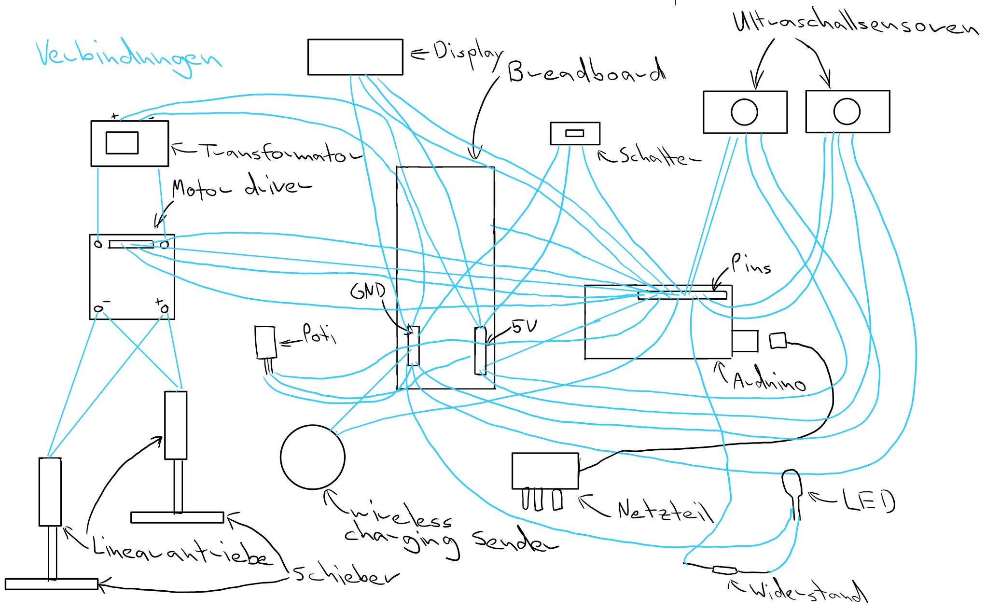
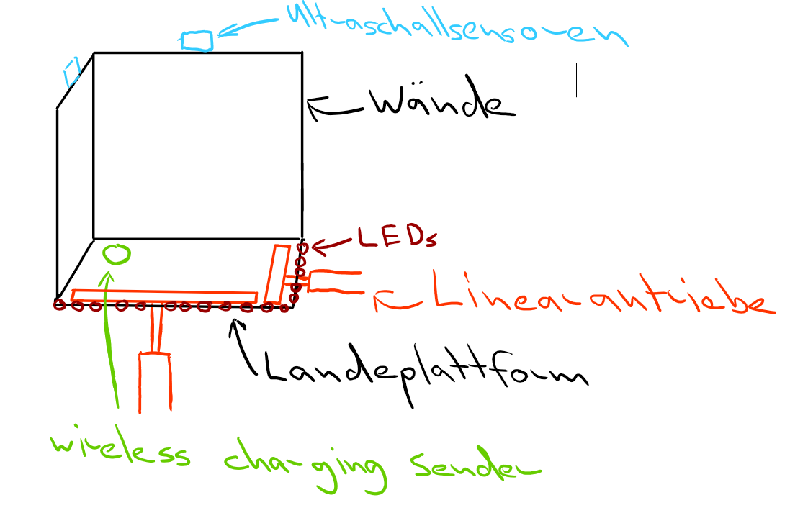

# Abstract  
In diesem Projekt baue ich eine automatische Ladevorrichtung für Drohnen. Sobald die Drohne vom Piloten auf einer Plattform gelandet wurde, wird ein Mechanismus aktiviert, der die Drohne in die richtige Position bringt und den Ladevorgang startet. Nach Abschluss des Ladevorgangs ist die Drohne wieder abflugbereit.
# Projekt im Detail
Der Pilot landet auf einer Landeplattform. Die Landeplattform verfügt an zwei Seiten über Wände, an denen zwei Ultraschallsensoren angebracht sind. An den anderen beiden Seiten ist jeweils ein Linearantrieb mit einem Schieber angebracht. Sobald die Ultraschallsensoren eine Drohne auf der Landeplattform erfassen, bewegen die Linearantriebe die Drohne so weit in die Ecke, bis sie sich in der richtigen Position befindet. Unterhalb der Landeplattform ist ein wireless charging Sender montiert, während sich unterhalb der Drohne der entsprechende wireless charging Empfänger befindet. Sobald die Ultraschallsesonren erkennen, dass sich die Drohne in der Ecke befindet, fließt Strom von einem Netzteil zum wireless charging Sender. Der Empfänger an der Drohne wandelt die Wechselspannung in Gleichstrom um, der dann in den Akku der Drohne fließt, der über ein Kabel mit dem wireless charging Empfänger verbunden ist. Sobald der Ladevorgang abgeschlossen ist, kann die Drohne wieder abheben.
## Muss
* Die Drohne muss in der Lage sein, auf einer Plattform zu landen.
* Die Drohne wird in die richtige Position bewegt und über Wireless Charging aufgeladen.
* Die Drohne muss nach dem Ladevorgang wieder abheben können.
## Optional
* Die Box ist mit Wettersensoren ausgestattet und gibt dem Piloten je nach Wetterbedingungen Empfehlungen, ob er fliegen sollte oder nicht.
* Während des Ladevorgangs und beim Fliegen bleibt die Box geschlossen, um die Drohne und die Box vor Niederschlag zu schützen.
* Die Box ist durch Solarpanels autark und kann sich bei gutem Wetter selbst wieder aufladen.
* Die Station ist mit LEDs ausgestattet, die den Landeplatz bei Dunkelheit beleuchten, sodass die Drohne auch nachts sicher landen kann.
* Die Station sendet Benachrichtigungen an den Piloten, wenn der Ladevorgang abgeschlossen ist.
* Die Station kann auf externe Wettervorhersagen zugreifen und den Piloten vor Sturm- oder Niederschlagwarnungen warnen.
* Die Station liest den Batteriezustand der Drohne aus und informiert den Piloten rechtzeitig über die Notwendigkeit einer Landung.
* Die Station verfügt über GPS, damit auch sicheres Landen ohne Sichtkontakt möglich ist, die schnellste Route zwischen Drohne und Ladestation angezeigt werden kann oder wenn die Station geklaut wurde, eine Nachverfolgung stattfinden kann.

# Zeitplan
<table>
  <thead>
    <tr>
      <th>Aufgabe</th>
      <th>fertig bis:</th>
    </tr>
  </thead>
  <tbody>
    <tr>
      <td>Projektbeschreibung</td>
      <td>19.11.24</td>
    </tr>
    <tr>
      <td>Bestellung Materialien</td>
      <td>26.11.24</td>
    </tr>
    <tr>
      <td>wireless charging</td>
      <td>17.12.24</td>
    </tr>
    <tr>
      <td>Mechanismus: Linearantriebe bewegen Drohne an richtige Stelle, sobald die Ultraschallsensoren die Erlaubnis gegeben haben</td>
      <td>07.01.25</td>
    </tr>
    <tr>
      <td>3D-Druck der Landeplattform und der Halterung an Drohne</td>
      <td>14.01.25</td>
    </tr>
    <tr>
      <td>wirless charging, Mechanimsus und 3D-Druck miteinander kombinieren</td>
      <td>04.02.25</td>
    </tr>
     <tr>
      <td>Dokumentation finalisieren</td>
      <td>11.02.25</td>
    </tr>
    <tr>
      <td>Reserve oder optionale Features einbauen</td>
      <td>18.02.25</td>
    </tr>
    <tr>
      <td>Abgabe Projekt</td>
      <td>28.02.25</td>
    </tr>
  </tbody>
</table>

# Skizze 
Hardware an der Landeplattform:

Hardware an der Drohne:

Visualisierung der Landeplattform:

# Kostenabschätzung
<table>
  <thead>
    <tr>
      <th>Komponenten</th>
      <th>Preis pro Stück</th>
      <th>Link</th>
    </tr>
  </thead>
  <tbody>
    <tr>
      <td>wireless charging Sender & Empfänger</td>
      <td>7.71 Fr.</td>
      <td>https://www.mouser.ch/ProductDetail/Seeed-Studio/106990017?qs=SElPoaY2y5KdLskE1shzqQ%3D%3D&mgh=1&utm_id=20002739518&gad_source=1&gclid=CjwKCAiA3ZC6BhBaEiwAeqfvyuNlfda5-xuXoLrLc3qdhUh8dxR87X4ZW45SWwa3tzxUaDRKo-8zQBoC-xEQAvD_BwE</td>
    </tr>
    <tr>
      <td>offenes Ende zu USB C</td>
      <td>5.45 Fr.</td>
      <td>https://www.conrad.ch/de/p/usb-c-3-1-stecker-mit-offenem-kabelende-usb-c-3-1-tc-2509033-tru-components-inhalt-1-st-1587137.html</td>
    </tr>
    <tr>
      <td>Netzteil</td>
      <td>5.33 Fr.</td>
      <td>https://www.reichelt.com/ch/de/shop/produkt/steckernetzteil_10_w_5_v_2_a-370227?PROVID=2808&gad_source=1&gclid=Cj0KCQiAi_G5BhDXARIsAN5SX7rT-tWpARV_9-TJFdsRmyKfdBHIgLwCn7fREIx21GYVdz2y2PMDzvgaAjFpEALw_wcB&q=%2Fch%2Fde%2Fshop%2Fsteckernetzteil-10-w-5-v-2-a-ys12v-0502000e-p370227.html </td>
    <tr>
      <td>Transformator</td>
      <td>3.90 Fr.</td>
      <td>https://www.bastelgarage.ch/dc-dc-1-5a-step-up-boost-converter </td>
    </tr>
    <tr>
      <td>Mosfet</td>
      <td>2.25 Fr.</td>
      <td>https://www.adafruit.com/product/355 </td>
    </tr>
    <tr>
      <td>Linearantrieb</td>
      <td>35.90 Fr.</td>
      <td>https://www.bastelgarage.ch/6v-electric-cylinder-100mm-128n?gad_source=1&gclid=Cj0KCQiAi_G5BhDXARIsAN5SX7pOlEy0XSUf0RxYFtqWwyanmA4Y5NWjRPP5CRwlg6IoworPIEc1klAaAvznEALw_wcB</td>
    </tr>
    <tr>
    <td>Motor driver</td>
    <td>6.60 Fr.</td>
    <td>https://www.conrad.ch/de/p/joy-it-sbc-motodriver2-entwickler-platine-1-st-1573541.html?utm_source=google-shopping-de&utm_medium=search&utm_campaign=shopping-online-de&utm_content=shopping-ad_cpc&WT.srch=1&ef_id=Cj0KCQiAi_G5BhDXARIsAN5SX7o6_0Nbb4KqGNjm55Ye8g1xzGAJNyGisIYAgcIQBwoagaDJP2YjFNAaAjlnEALw_wcB%3AG%3As&utm_source=google&utm_medium=cpc&utm_campaign=ade_3_shopping_GERMAN&utm_id=319998844&gad_source=1&gclid=Cj0KCQiAi_G5BhDXARIsAN5SX7o6_0Nbb4KqGNjm55Ye8g1xzGAJNyGisIYAgcIQBwoagaDJP2YjFNAaAjlnEALw_wcB </td>
    </tr>
    <tr>
    <td>Ultraschallsensor</td>
    <td>3.28 Fr.</td>
    <td>https://www.reichelt.com/ch/de/shop/produkt/entwicklerboards_-_ultraschall_abstandssensor_hc-sr04-161487?PROVID=2788&gad_source=1&gclid=CjwKCAiAl4a6BhBqEiwAqvrquhSdVMxJ-SXono8RQaygsfe0myq6rt9zlikawhww3HqIJLXRNSHbShoCsIEQAvD_BwE&q=%2Fch%2Fde%2Fshop%2Fentwicklerboards-ultraschall-abstandssensor-hc-sr04-debo-sen-ultra-p161487.html </td>
    </tr>
  </tbody>
</table>
Bemerkung: Ich brauche zwei Linearantriebe und zwei Ultraschallsensoren.
