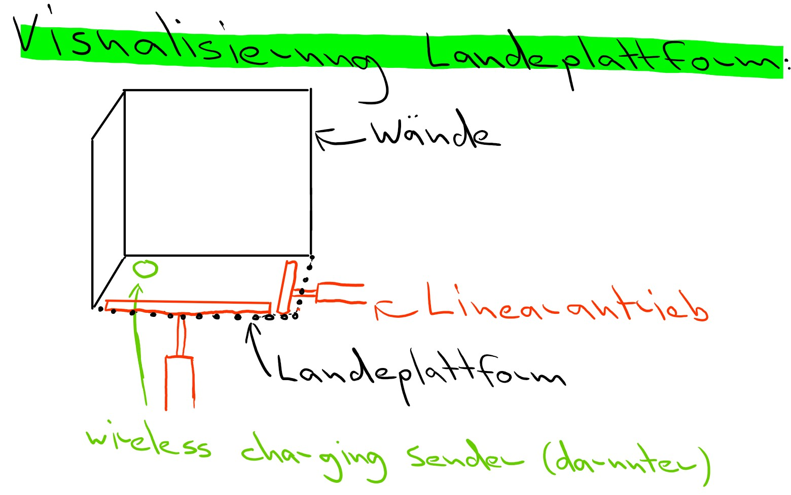

# Abstract  
In diesem Projekt baue ich eine automatische Ladungssation für Drohnen. Sobald die Drohne vom Pilot auf einer Plattform gelandet wurde, setzt ein Mechanismus für das Laden der Drohne ein. Wenn das Laden abgeschlossen ist, ist die Drohne wieder abflugbereit.
# Projekt im Detail
Der Pilot landet auf einer Landeplattform. Die Landeplattform verfügt an zwei Seiten über Wände, an denen jeweils ein Ultraschallsensor angebracht ist. An den zwei anderen Seiten befinden sich je ein Linearantrieb, an dem ein Schieber angebracht ist. Die Ultraschallsensoren messen die Entfernung der Drohne zu den Wänden. Der Arduino entscheidet, ob die Drohne bereits an der richtigen Position befindet (in der Ecke der zwei Wänden). Wenn dies nicht der Fall ist, bewegen die Linearantriebe die Drohne so weit in die Ecke, bis die Drohne an der richtigen Position befindet. Unterhalb der Landeplattform ist ein Wireless charging Sender und unterhalb der Drohne ein Wireless charging Empfänger montiert. Sobald die Wireless charging Komponenten übereinander liegen, fliesst Strom von einem Netzteil zum Wireless charging Sender. Der Wireless charging Empfänger an der Drohne wandelt die Wechselspannung wieder in Gleichstrom um. Der Strom fliesst dann in den Akku der Drohne, der mit einem Kabel verbunden ist. Sobald der Ladevorgang abgeschlossen ist, kann die Drohne wieder abheben.
## Muss
* Die Drohne muss auf einer Plattform landen können.
* Die Drohne wird in die richtige Position gebracht und mit wireless charging geladen.
* Die Drohne ist fähig, wieder abzuheben.
## Optional
* Die Box verfügt über Wettersensoren und gibt dem Piloten je nach Wetterverhältnissen Empfehlungen über das Fliegen / nicht Fliegen.
* Die Box ist während dem Ladevorgang und dem Fliegen der Drohne geschlossen. Dies schützt die Drohne und die Box vor Niederschlag.
* Die Box ist mittels Solarpanels autark. Bei gutem Wetter kann sie sich von selbst wiederaufladen.
* Die Station verfügt über LEDs, die den Landeplatz bei Dunkelheit beleuchten, sodass die Drohne auch nachts sicher landen kann.
* Die Station sendet Benachrichtigungen an den Piloten, wenn der Ladevorgang abgeschlossen ist.
* Die Station kann auf externe Wettervorhersagen zugreifen und den Piloten über Sturm- / Niederschlagwarnungen warnen.
* Die Station liest den Batteriezustand der Drohne aus und informiert den Piloten über eine rechtzeitige Landung.
# Zeitplan
<table>
  <thead>
    <tr>
      <th>Aufgabe</th>
      <th>fertig bis:</th>
    </tr>
  </thead>
  <tbody>
    <tr>
      <td>Projektbeschreibung</td>
      <td>19.11.24</td>
    </tr>
    <tr>
      <td>Bestellung Materialien</td>
      <td>26.11.24</td>
    </tr>
    <tr>
      <td>Wireless charging</td>
      <td>17.12.24</td>
    <tr>
      <td>Landeplattform und Mechanismus, der die Drohne in die richtige Position transportiert</td>
      <td>18.01.25</td>
    </tr>
    </tr>
    <tr>
      <td>Reserve oder optionale Features einbauen</td>
      <td>18.02.25</td>
    </tr>
    <tr>
      <td>Abgabe Projekt</td>
      <td>21.02.25</td>
    </tr>
  </tbody>
</table>

# Skizze 

# Kostenabschätzung
<table>
  <thead>
    <tr>
      <th>Komponenten</th>
      <th>Preis pro Stück</th>
      <th>Link</th>
    </tr>
  </thead>
  <tbody>
    <tr>
      <td>Wireless charging Sender & Empfänger</td>
      <td>7.71 Fr.</td>
      <td>https://www.mouser.ch/ProductDetail/Seeed-Studio/106990017?qs=SElPoaY2y5KdLskE1shzqQ%3D%3D&mgh=1&utm_id=20002739518&gad_source=1&gclid=CjwKCAiA3ZC6BhBaEiwAeqfvyuNlfda5-xuXoLrLc3qdhUh8dxR87X4ZW45SWwa3tzxUaDRKo-8zQBoC-xEQAvD_BwE</td>
    </tr>
    <tr>
      <td>offenes Ende zu USB C</td>
      <td>2.80 Fr.</td>
      <td>https://www.brack.ch/delock-usb-stromkabel-micro-usb-b-offen-0-1-m-402206?utm_source=google&utm_medium=cpc&utm_campaign=%21cc-pssh%21l-d%21e-g%21t-pla%21t2-css%21k1-it%21z-it_multimedia_pmax&utm_term=&adgroup_id=&ad_position=&ad_type=pla&campaign_id=18732681987&gad_source=1&gclid=Cj0KCQiAi_G5BhDXARIsAN5SX7qQI4-gUtL5nZU0V28ZiZdfYvwMI_oJ12A6JlMSsK3Fn7kvi64xrdwaAtrfEALw_wcB&hc_fcv=ZzyTPAKYsXpnZCA8~NnmHD2A7XPOcW--ozzzzzzzz~NmMwpN-2n_4NzUD7zzzzzzzz </td>
    </tr>
    <tr>
      <td>Netzteil</td>
      <td>5.33 Fr.</td>
      <td>https://www.reichelt.com/ch/de/shop/produkt/steckernetzteil_10_w_5_v_2_a-370227?PROVID=2808&gad_source=1&gclid=Cj0KCQiAi_G5BhDXARIsAN5SX7rT-tWpARV_9-TJFdsRmyKfdBHIgLwCn7fREIx21GYVdz2y2PMDzvgaAjFpEALw_wcB&q=%2Fch%2Fde%2Fshop%2Fsteckernetzteil-10-w-5-v-2-a-ys12v-0502000e-p370227.html </td>
    <tr>
      <td>Transformator</td>
      <td>3.90 Fr.</td>
      <td>https://www.bastelgarage.ch/dc-dc-1-5a-step-up-boost-converter </td>
    </tr>
    <tr>
      <td>USB C zu USB C Buchse</td>
      <td>3.45 Fr.</td>
  
  <td>https://www.reichelt.com/ch/de/shop/produkt/usb_3_1_adapter_c_buchse_auf_c_buchse-334204?PROVID=2808&gad_source=1&gclid=Cj0KCQiAgJa6BhCOARIsAMiL7V_titRytBqwA0Gy1v7FJ-Bq9HDkKADi7Hypsq4n8LuFO0V1X0WMRuMaAgEkEALw_wcB&q=%2Fch%2Fde%2Fshop%2Fusb-3-1-adapter-c-buchse-auf-c-buchse-shvp-bs13-40003-p334204.html </td>
    </tr>
    <tr>
      <td>Mosfet</td>
      <td>2.25 Fr.</td>
      <td>https://www.adafruit.com/product/355 </td>
    </tr>
    <tr>
      <td>Ultraschallsensor</td>
      <td>3.28 Fr.</td>
      <td>https://www.reichelt.com/ch/de/shop/produkt/entwicklerboards_-_ultraschall_abstandssensor_hc-sr04-161487?PROVID=2788&gad_source=1&gclid=CjwKCAiAl4a6BhBqEiwAqvrquhSdVMxJ-SXono8RQaygsfe0myq6rt9zlikawhww3HqIJLXRNSHbShoCsIEQAvD_BwE&q=%2Fch%2Fde%2Fshop%2Fentwicklerboards-ultraschall-abstandssensor-hc-sr04-debo-sen-ultra-p161487.html </td>
    </tr>
    <tr>
      <td>Linearantrieb</td>
      <td>26.40 Fr.</td>
      <td>https://www.digikey.ch/de/products/detail/dfrobot/FIT0806/14824997?utm_adgroup=General&utm_source=google&utm_medium=cpc&utm_campaign=Shopping_Product_All%20%28Catch-up%29&utm_term=&productid=14824997&utm_content=General&utm_id=go_cmp-17998691427_adg-142975836667_ad-615797033692_pla-928703728693_dev-c_ext-_prd-14824997_sig-Cj0KCQiAi_G5BhDXARIsAN5SX7rssZ3EEsqBEBEYH0yZeIE8DGDnWFBT3iVk8qHvuoOBPWbMhP5sOa0aAuQsEALw_wcB&gad_source=1&gclid=Cj0KCQiAi_G5BhDXARIsAN5SX7rssZ3EEsqBEBEYH0yZeIE8DGDnWFBT3iVk8qHvuoOBPWbMhP5sOa0aAuQsEALw_wcB </td>
    </tr>
    <tr>
    <td>Motor driver</td>
    <td>6.60 Fr.</td>
    <td>https://www.conrad.ch/de/p/joy-it-sbc-motodriver2-entwickler-platine-1-st-1573541.html?utm_source=google-shopping-de&utm_medium=search&utm_campaign=shopping-online-de&utm_content=shopping-ad_cpc&WT.srch=1&ef_id=Cj0KCQiAi_G5BhDXARIsAN5SX7o6_0Nbb4KqGNjm55Ye8g1xzGAJNyGisIYAgcIQBwoagaDJP2YjFNAaAjlnEALw_wcB%3AG%3As&utm_source=google&utm_medium=cpc&utm_campaign=ade_3_shopping_GERMAN&utm_id=319998844&gad_source=1&gclid=Cj0KCQiAi_G5BhDXARIsAN5SX7o6_0Nbb4KqGNjm55Ye8g1xzGAJNyGisIYAgcIQBwoagaDJP2YjFNAaAjlnEALw_wcB </td>
    </tr>
  </tbody>
</table>
Bemerkung: Ich brauche zwei Linearantriebe, zwei Transformatoren und zwei Ultraschallsensoren.
